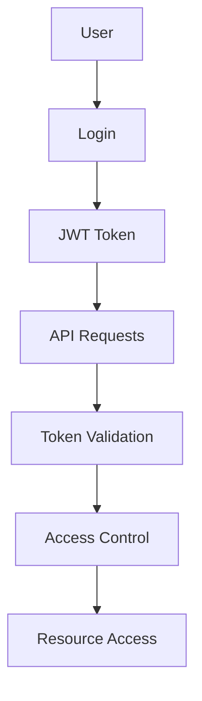
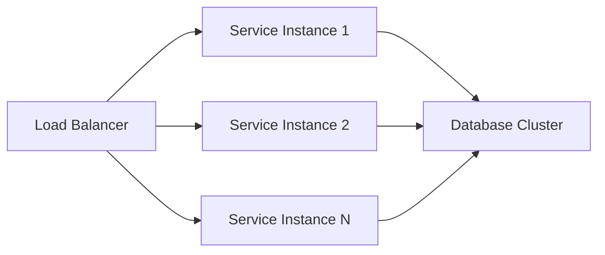
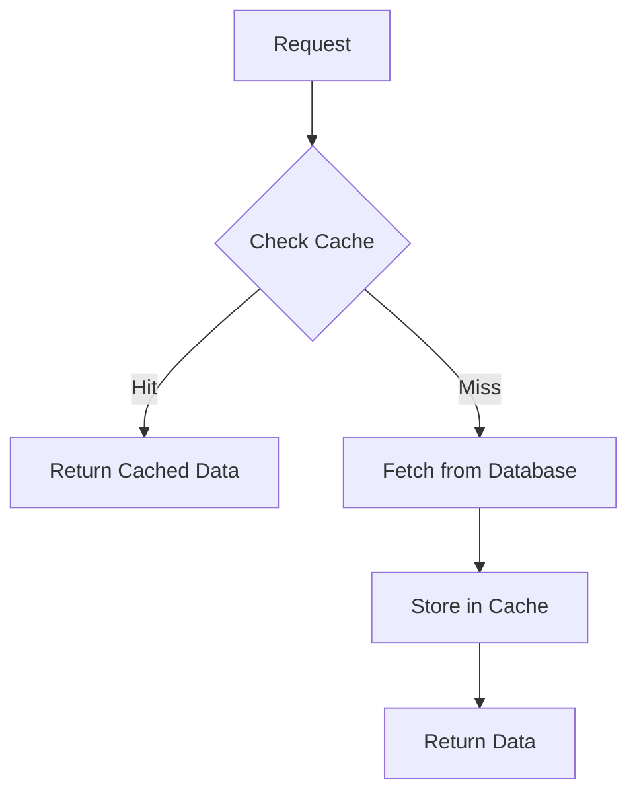

# Architecture Documentation

## System Overview

The QI Digital Platform is a microservices-based architecture designed for quality infrastructure digital twin management and analytics.

## High-Level Architecture

```
┌─────────────────┐    ┌─────────────────┐    ┌─────────────────┐
│   Web Browser   │    │   Mobile App    │    │   API Clients   │
└─────────┬───────┘    └─────────┬───────┘    └─────────┬───────┘
          │                      │                      │
          └──────────────────────┼──────────────────────┘
                                 │
                    ┌─────────────┴─────────────┐
                    │     Load Balancer         │
                    │      (Nginx/HAProxy)      │
                    └─────────────┬─────────────┘
                                  │
        ┌─────────────────────────┼─────────────────────────┐
        │                         │                         │
┌───────▼────────┐    ┌───────────▼──────────┐    ┌────────▼────────┐
│  Flask Webapp  │    │   API Gateway        │    │  Static Assets  │
│   (Port 5000)  │    │   (Optional)         │    │   (CDN)         │
└───────┬────────┘    └───────────┬──────────┘    └─────────────────┘
        │                         │
        └─────────────────────────┼─────────────────────────┐
                                  │                         │
        ┌─────────────────────────┼─────────────────────────┼─────────────────────────┐
        │                         │                         │                         │
┌───────▼────────┐    ┌───────────▼──────────┐    ┌────────▼────────┐    ┌───────────▼──────────┐
│  AI/RAG System │    │ Digital Twin Registry│    │Certificate Mgr  │    │Analytics Dashboard   │
│  (Port 8000)   │    │   (Port 8001)        │    │  (Port 3001)    │    │   (Port 3002)        │
└───────┬────────┘    └───────────┬──────────┘    └────────┬────────┘    └───────────┬──────────┘
        │                         │                        │                         │
        └─────────────────────────┼─────────────────────────┼─────────────────────────┘
                                  │                         │
                    ┌─────────────┴─────────────────────────┴─────────────┐
                    │              Data Layer                              │
                    │  ┌─────────────┐  ┌─────────────┐  ┌─────────────┐  │
                    │  │ PostgreSQL  │  │    Redis    │  │   Qdrant    │  │
                    │  │   Database  │  │   Cache     │  │Vector Store │  │
                    │  └─────────────┘  └─────────────┘  └─────────────┘  │
                    └─────────────────────────────────────────────────────┘
```

## Service Architecture

### 1. Flask Webapp (Frontend)

**Technology Stack**:
- Flask (Python web framework)
- Bootstrap (CSS framework)
- JavaScript (Vanilla JS)
- Jinja2 (Template engine)

**Responsibilities**:
- User interface
- Navigation and routing
- Form handling
- Static asset serving

**Key Components**:
- `app.py` - Main Flask application
- `templates/` - HTML templates
- `static/` - CSS, JS, images
- `config/` - Configuration management

### 2. AI/RAG System (FastAPI)

**Technology Stack**:
- FastAPI (Python web framework)
- Sentence Transformers (Embeddings)
- OpenAI/Anthropic APIs
- Qdrant (Vector database)

**Responsibilities**:
- Natural language processing
- Document retrieval
- AI-powered analysis
- Knowledge base management

**Key Components**:
- `main.py` - FastAPI application
- `services/` - Business logic
- `models.py` - Data models
- `api/` - API endpoints

### 3. Digital Twin Registry (FastAPI)

**Technology Stack**:
- FastAPI (Python web framework)
- SQLAlchemy (ORM)
- PostgreSQL (Database)
- Pydantic (Data validation)

**Responsibilities**:
- Digital twin management
- Asset registration
- Metadata storage
- Relationship management

**Key Components**:
- `main.py` - FastAPI application
- `models.py` - Twin models
- `database.py` - Database operations
- `api/` - API endpoints

### 4. Certificate Manager (Node.js)

**Technology Stack**:
- Express.js (Node.js framework)
- PostgreSQL (Database)
- JWT (Authentication)
- PDF generation

**Responsibilities**:
- Digital certificate management
- Certificate generation
- Validation and verification
- Expiry tracking

**Key Components**:
- `src/server.js` - Express server
- `public/` - Static files
- `routes/` - API routes
- `services/` - Business logic

### 5. Analytics Dashboard (Node.js)

**Technology Stack**:
- Express.js (Node.js framework)
- Chart.js (Visualization)
- Socket.io (Real-time updates)
- PostgreSQL (Database)

**Responsibilities**:
- Data visualization
- Real-time analytics
- Performance monitoring
- Alert management

**Key Components**:
- `src/server.js` - Express server
- `public/` - Static files
- `routes/` - API routes
- `services/` - Analytics logic

## Data Architecture

### Database Design

#### PostgreSQL Schema

```sql
-- Digital Twins
CREATE TABLE digital_twins (
    id SERIAL PRIMARY KEY,
    name VARCHAR(255) NOT NULL,
    type VARCHAR(100) NOT NULL,
    description TEXT,
    location VARCHAR(255),
    status VARCHAR(50) DEFAULT 'active',
    metadata JSONB,
    created_at TIMESTAMP DEFAULT CURRENT_TIMESTAMP,
    updated_at TIMESTAMP DEFAULT CURRENT_TIMESTAMP
);

-- Certificates
CREATE TABLE certificates (
    id SERIAL PRIMARY KEY,
    name VARCHAR(255) NOT NULL,
    type VARCHAR(100) NOT NULL,
    digital_twin_id INTEGER REFERENCES digital_twins(id),
    issuer VARCHAR(255),
    issued_date DATE,
    expiry_date DATE,
    status VARCHAR(50) DEFAULT 'active',
    metadata JSONB,
    created_at TIMESTAMP DEFAULT CURRENT_TIMESTAMP
);

-- Analytics Data
CREATE TABLE analytics_data (
    id SERIAL PRIMARY KEY,
    twin_id INTEGER REFERENCES digital_twins(id),
    metric_name VARCHAR(100),
    metric_value DECIMAL,
    timestamp TIMESTAMP DEFAULT CURRENT_TIMESTAMP
);
```

#### Redis Usage

- Session storage
- Caching
- Rate limiting
- Real-time data

#### Qdrant Vector Store

- Document embeddings
- Semantic search
- Similarity matching

### Data Flow

```
1. User Input → Flask Webapp
2. Webapp → API Gateway
3. API Gateway → Microservices
4. Microservices → Database Layer
5. Database Layer → Response
6. Response → User Interface
```

## Security Architecture

### Authentication & Authorization



### Security Layers

1. **Network Security**
   - HTTPS/TLS encryption
   - Firewall rules
   - VPN access

2. **Application Security**
   - Input validation
   - SQL injection prevention
   - XSS protection

3. **Data Security**
   - Encryption at rest
   - Encryption in transit
   - Access controls

## Scalability Architecture

### Horizontal Scaling



### Microservices Scaling

- **Stateless Services**: Easy horizontal scaling
- **Database Scaling**: Read replicas, sharding
- **Caching**: Redis cluster, CDN
- **Message Queues**: Async processing

## Monitoring & Observability

### Health Checks

All services provide health check endpoints:
- `/health` - Service status
- `/ready` - Readiness probe
- `/live` - Liveness probe

### Logging

- **Structured Logging**: JSON format
- **Log Aggregation**: Centralized logging
- **Log Levels**: DEBUG, INFO, WARNING, ERROR

### Metrics

- **Application Metrics**: Response times, error rates
- **Infrastructure Metrics**: CPU, memory, disk
- **Business Metrics**: User activity, data volume

### Tracing

- **Distributed Tracing**: Request flow across services
- **Performance Monitoring**: Bottleneck identification
- **Error Tracking**: Exception monitoring

## Deployment Architecture

### Container Strategy

```yaml
# docker-compose.yml
version: '3.8'
services:
  webapp:
    build: ./webapp
    ports:
      - "5000:5000"
    environment:
      - FLASK_ENV=production
  
  ai-rag:
    build: ./backend/ai-rag
    ports:
      - "8000:8000"
  
  twin-registry:
    build: ./backend/twin-registry
    ports:
      - "8001:8001"
  
  certificate-manager:
    build: ./backend/certificate-manager
    ports:
      - "3001:3001"
  
  analytics:
    build: ./backend/qi-analytics
    ports:
      - "3002:3002"
  
  postgres:
    image: postgres:15
    environment:
      POSTGRES_DB: qi_platform
      POSTGRES_USER: qi_user
      POSTGRES_PASSWORD: secure_password
  
  redis:
    image: redis:7-alpine
  
  qdrant:
    image: qdrant/qdrant
    ports:
      - "6333:6333"
```

### Environment Strategy

- **Development**: Local development with hot reload
- **Staging**: Production-like environment for testing
- **Production**: Optimized, monitored, and secured

## Integration Architecture

### External APIs

- **OpenAI API**: AI text generation
- **Anthropic API**: Alternative AI provider
- **AASX Explorer**: Asset Administrative Shell

### Data Integration

- **ETL Processes**: Data extraction and transformation
- **API Integration**: RESTful API consumption
- **File Upload**: Document processing
- **Real-time Sync**: Live data updates

## Performance Architecture

### Caching Strategy



### Optimization Techniques

1. **Database Optimization**
   - Indexing strategies
   - Query optimization
   - Connection pooling

2. **Application Optimization**
   - Async processing
   - Background jobs
   - Memory management

3. **Network Optimization**
   - CDN usage
   - Compression
   - Caching headers

## Disaster Recovery

### Backup Strategy

- **Database Backups**: Daily automated backups
- **File Backups**: Document and configuration backups
- **Configuration Backups**: Environment and service configs

### Recovery Procedures

1. **Data Recovery**: Database restoration
2. **Service Recovery**: Service restart procedures
3. **Infrastructure Recovery**: Cloud provider recovery

## Future Architecture Considerations

### Planned Enhancements

1. **Service Mesh**: Istio for service-to-service communication
2. **Event Streaming**: Kafka for event-driven architecture
3. **Machine Learning Pipeline**: Automated model training
4. **Blockchain Integration**: Certificate verification
5. **IoT Integration**: Real-time sensor data

### Technology Evolution

- **Container Orchestration**: Kubernetes deployment
- **Serverless Functions**: Event-driven processing
- **Edge Computing**: Distributed processing
- **AI/ML Integration**: Advanced analytics 